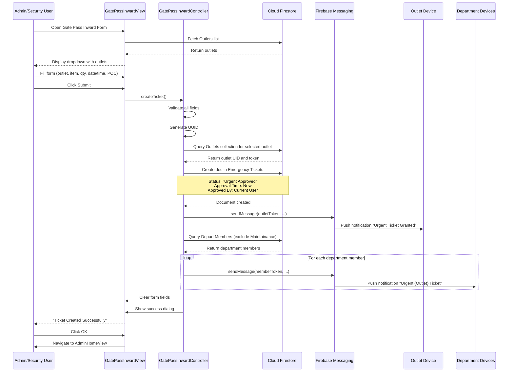
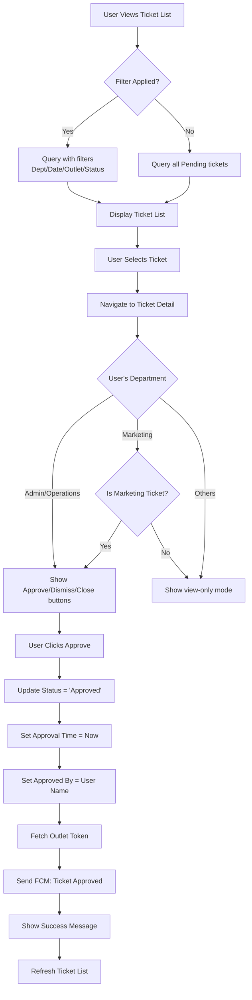
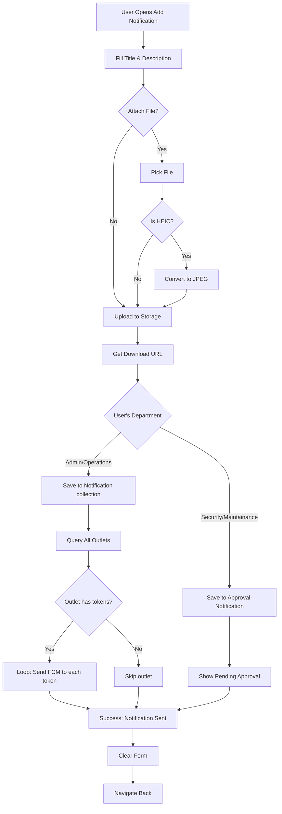
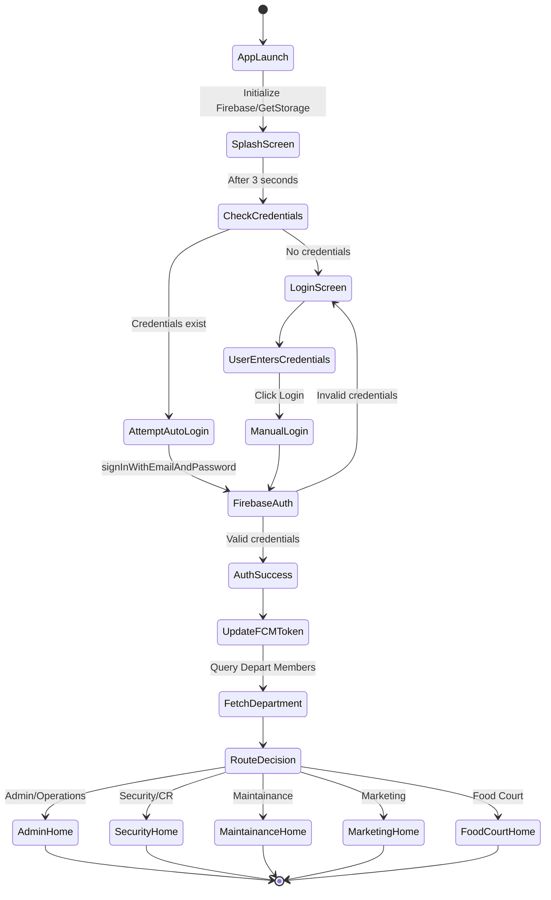

# SquareOne Admin - Comprehensive Application Documentation

**Version**: 4.0.0+40  
**Platform**: Flutter (Dart SDK >=3.2.3 <4.0.0)  
**Last Updated**: January 8, 2026  
**Documentation Type**: Complete Technical & Functional Reference

---

## Table of Contents

1. [Executive Summary](#1-executive-summary)
2. [Application Overview](#2-application-overview)
3. [Technical Architecture](#3-technical-architecture)
4. [Complete Firestore Database Schema](#4-complete-firestore-database-schema)
5. [User Roles & Permissions System](#5-user-roles--permissions-system)
6. [Authentication & Authorization Flow](#6-authentication--authorization-flow)
7. [Core Functional Operations](#7-core-functional-operations)
8. [Detailed Feature Workflows](#8-detailed-feature-workflows)
9. [Notification System Architecture](#9-notification-system-architecture)
10. [File Structure & Code Organization](#10-file-structure--code-organization)
11. [State Management & Data Flow](#11-state-management--data-flow)
12. [API Integration & External Services](#12-api-integration--external-services)
13. [Security Considerations & Best Practices](#13-security-considerations--best-practices)
14. [Deployment & Configuration](#14-deployment--configuration)
15. [Troubleshooting & Maintenance](#15-troubleshooting--maintenance)
16. [Future Enhancement Recommendations](#16-future-enhancement-recommendations)

---

## 1. Executive Summary

**SquareOne Admin** is a comprehensive Flutter-based administrative application designed to manage retail and food court operations within a commercial facility. The application serves as a centralized platform for managing outlets, department operations, ticketing systems, emergency gate passes, and inter-departmental communications.

### Key Capabilities:
- **Multi-department Management**: Supports 7 distinct department roles with customized dashboards and workflows
- **Real-time Ticket Management**: Emergency tickets, gate passes (inward/outward), maintenance requests, security incidents
- **Outlet Administration**: Complete lifecycle management for retail and food court outlets
- **Push Notification System**: FCM-based real-time notifications for critical operations
- **Role-based Access Control**: Granular permissions based on department assignments
- **Document Management**: File upload, storage, and distribution through Firebase Storage
- **Approval Workflows**: Multi-tier approval processes for sensitive operations

### Target Users:
1. **Administrative Staff** (Admin/Operations)
2. **Security Personnel** (Security/Customer Relations)
3. **Maintenance Team**
4. **Marketing Department**
5. **Food Court Management**
6. **Retail Outlet Operators**

---

## 2. Application Overview

### 2.1 Purpose & Scope

SquareOne Admin is designed to streamline operations in a multi-tenant commercial facility (likely a shopping mall or commercial complex). It addresses the following operational challenges:

1. **Gate Pass Management**: Controlling movement of goods/materials in and out of premises
2. **Emergency Response**: Quick ticket creation and routing for urgent issues
3. **Inter-departmental Coordination**: Ensuring proper communication and workflow between departments
4. **Outlet Monitoring**: Tracking outlet status, workers, and operational metrics
5. **Compliance & Reporting**: Generating carton reports, activity logs, and audit trails
6. **Notification Distribution**: Broadcasting important announcements to all stakeholders

### 2.2 Application Type & Platform Support

- **Framework**: Flutter (cross-platform native mobile application)
- **Supported Platforms**: 
  - Android (primary target)
  - iOS (full support with Pods configuration)
  - Web (configured but may have limited functionality)
  - Desktop (Linux, macOS, Windows - configured but not production-ready)

### 2.3 Core Technologies

| Technology | Purpose | Version/Package |
|------------|---------|-----------------|
| **Flutter SDK** | UI Framework | >=3.2.3 <4.0.0 |
| **Firebase Core** | Backend Infrastructure | ^3.13.0 |
| **Firebase Authentication** | User Authentication | ^5.5.2 |
| **Cloud Firestore** | NoSQL Database | ^5.6.6 |
| **Firebase Messaging** | Push Notifications (FCM) | ^15.2.5 |
| **Firebase Storage** | File Storage | Latest |
| **GetX** | State Management & Routing | ^4.7.2 |
| **Get Storage** | Local Persistent Storage | ^2.1.1 |
| **googleapis_auth** | Service Account Authentication | Latest |

---

## 3. Technical Architecture

### 3.1 Architecture Pattern

The application follows a **Model-View-Controller (MVC)** pattern implemented through GetX framework:

```
┌─────────────────────────────────────────────────────────────┐
│                     Presentation Layer                       │
│  ┌──────────────┐  ┌──────────────┐  ┌──────────────┐      │
│  │  Views (.dart)│  │  Components  │  │   Widgets    │      │
│  │  - Splash    │  │  - Buttons   │  │  - Custom    │      │
│  │  - Auth      │  │  - TextFields│  │  - Shared    │      │
│  │  - Home      │  │  - Dialogs   │  │              │      │
│  │  - Forms     │  │  - Colors    │  │              │      │
│  └──────────────┘  └──────────────┘  └──────────────┘      │
└─────────────────────────────────────────────────────────────┘
                            ↕
┌─────────────────────────────────────────────────────────────┐
│                      Business Logic Layer                    │
│  ┌──────────────────────────────────────────────────────┐   │
│  │        Controllers (GetxController)                   │   │
│  │  - SplashController                                   │   │
│  │  - LoginController                                    │   │
│  │  - TicketController                                   │   │
│  │  - GatePassInwardController                           │   │
│  │  - AddNotificationsController                         │   │
│  │  - AddOutletController                                │   │
│  │  - AddDepartmentController                            │   │
│  └──────────────────────────────────────────────────────┘   │
└─────────────────────────────────────────────────────────────┘
                            ↕
┌─────────────────────────────────────────────────────────────┐
│                        Data Layer                            │
│  ┌──────────────┐  ┌──────────────┐  ┌──────────────┐      │
│  │  Firebase    │  │  GetStorage  │  │   Helpers    │      │
│  │  - Firestore │  │  - Local     │  │  - Notif     │      │
│  │  - Auth      │  │  - Cache     │  │  - Utils     │      │
│  │  - Storage   │  │              │  │              │      │
│  │  - Messaging │  │              │  │              │      │
│  └──────────────┘  └──────────────┘  └──────────────┘      │
└─────────────────────────────────────────────────────────────┘
```

### 3.2 State Management Strategy

**GetX Reactive State Management** is used throughout the application:

1. **Reactive Variables**: `RxBool`, `RxString`, `RxInt`, `RxList` for auto-updating UI
2. **Dependency Injection**: `Get.put()`, `Get.lazyPut()` for controller instantiation
3. **State Builders**: `GetBuilder<T>` and `Obx()` for reactive UI updates
4. **Navigation**: `Get.to()`, `Get.offAll()`, `Get.back()` for route management

**Example Pattern**:
```dart
class TicketController extends GetxController {
  RxBool isLoading = false.obs;  // Reactive boolean
  RxString filter = ''.obs;       // Reactive string
  
  void fetchTickets() {
    isLoading.value = true;  // Triggers UI update
    // ... fetch logic
    isLoading.value = false; // Triggers UI update
  }
}

// In View:
Obx(() => controller.isLoading.value 
    ? CircularProgressIndicator() 
    : TicketList())
```

### 3.3 Navigation Architecture

The app uses **programmatic navigation** without named routes:

```
Splash Screen (Auto-redirect after 3s)
    ↓
Login Screen (if no stored credentials)
    ↓
Department-Specific Home (based on user's department)
    ├── Admin/Operations → AdminHomeView
    ├── Security/CR → SecurityHomeView
    ├── Maintenance → MaintenanceHomeView
    ├── Marketing → MarketingHomeView
    └── Food Court → FoodDeptHomeView
```

Each home view has a bottom navigation bar with department-specific pages.

### 3.4 Data Persistence Strategy

**Two-tier storage approach**:

1. **Local Storage (GetStorage)**:
   - User credentials (email, password) - **Security Risk**
   - User name
   - Session tokens
   - Temporary cache

2. **Cloud Storage (Firebase Firestore)**:
   - All master data
   - Transactional data
   - Real-time synchronized data

3. **File Storage (Firebase Storage)**:
   - Notification attachments
   - Document uploads
   - Images (with HEIC to JPEG conversion)

---

## 4. Complete Firestore Database Schema

### 4.1 Schema Overview

The application uses **6 primary collections** in Cloud Firestore:

1. **Outlets** - Retail and food court outlet master data
2. **Depart Members** - Department employee/admin master data
3. **Emergency Tickets** - Urgent tickets (gate passes, emergencies)
4. **Tickets** - General ticket management system
5. **Notification** - Broadcast notifications to all outlets
6. **Approval-Notification** - Notifications pending admin approval

### 4.2 Collection: `Outlets`

**Purpose**: Master database for all retail outlets and food court tenants

**Document ID**: Email address of the outlet (e.g., `outlet@example.com`)

**Schema**:

| Field Name | Data Type | Required | Description | Example Values |
|------------|-----------|----------|-------------|----------------|
| `Outlet Name` | String | Yes | Display name of the outlet | "Zara", "McDonald's", "Nike Store" |
| `POC` | String | Yes | Point of Contact person name | "John Smith" |
| `Contact Number` | String | Yes | Phone number for contact | "+1234567890" |
| `Email` | String | Yes | Email address (also used as doc ID) | "outlet@example.com" |
| `Password` | String | Yes | **PLAINTEXT PASSWORD** ⚠️ | "password123" |
| `status` | String | Yes | Operational status of outlet | "Active", "Inactive" |
| `token` | String/Array | Yes | FCM device token(s) for push notifications | "fcm_token_xyz..." or ["token1", "token2"] |
| `outlet type` | String | Yes | Category of outlet | "Retail Outlet", "Food Court Outlet" |
| `uid` | String | Auto | Firebase Auth UID (added after user creation) | "xyz123abc..." |

**Security Concerns**:
- ⚠️ **CRITICAL**: Passwords are stored in plaintext - this is a severe security vulnerability
- Recommendation: Remove password field and rely solely on Firebase Authentication

**Indexing Recommendations**:
- Index on `status` for active outlet queries
- Index on `outlet type` for filtering by category
- Compound index on `status` + `outlet type`

**Usage Patterns**:
```dart
// Creating an outlet
firebaseFirestore.collection('Outlets').doc(email).set({
  'Outlet Name': name,
  'POC': poc,
  'Contact Number': contact,
  'Email': email,
  'Password': password,  // ⚠️ Security risk
  'status': 'Active',
  'token': '',
  'outlet type': selectedType
});

// Querying outlets by name
firebaseFirestore.collection('Outlets')
  .where('Outlet Name', isEqualTo: outletName)
  .get();
```

---

### 4.3 Collection: `Depart Members`

**Purpose**: Master database for all department employees and administrators

**Document ID**: Email address of the employee (e.g., `admin@example.com`)

**Schema**:

| Field Name | Data Type | Required | Description | Example Values |
|------------|-----------|----------|-------------|----------------|
| `Name` | String | Yes | Full name of employee | "Jane Doe" |
| `Contact Number` | String | Yes | Phone number | "+1234567890" |
| `Email` | String | Yes | Email address (also doc ID) | "admin@example.com" |
| `Password` | String | Yes | **PLAINTEXT PASSWORD** ⚠️ | "admin123" |
| `Department` | String | Yes | Department/role assignment | See list below |
| `token` | String/Array | Yes | FCM device token(s) | "fcm_token_abc..." or array |

**Department Values** (Enum-like):
1. `"Admin"` - Full administrative access
2. `"Operations"` - Operations team (same permissions as Admin)
3. `"Security"` - Security personnel
4. `"CR"` - Customer Relations (same permissions as Security)
5. `"Maintainance"` - Maintenance team (**Note**: Typo in code - "Maintainance" instead of "Maintenance")
6. `"Marketing"` - Marketing department
7. `"Food Court"` - Food court management

**Permission Matrix**:

| Department | Create Tickets | Approve Tickets | Close Tickets | Add Outlets | Add Members | Send Notifications |
|------------|---------------|-----------------|---------------|-------------|-------------|--------------------|
| Admin | ✅ | ✅ | ✅ | ✅ | ✅ | ✅ (Direct) |
| Operations | ✅ | ✅ | ✅ | ✅ | ✅ | ✅ (Direct) |
| Security | ✅ | ❌ | ❌ | ❌ | ❌ | ✅ (Requires Approval) |
| CR | ✅ | ❌ | ❌ | ❌ | ❌ | ✅ (Requires Approval) |
| Maintainance | ✅ | ❌ | ❌ | ❌ | ❌ | ✅ (Requires Approval) |
| Marketing | ✅ | ✅ (Marketing only) | ❌ | ❌ | ❌ | ❌ |
| Food Court | ✅ | ❌ | ❌ | ❌ | ❌ | ❌ |

**Usage Patterns**:
```dart
// Routing based on department
switch (userData['Department']) {
  case 'Admin':
  case 'Operations':
    Get.offAll(() => AdminHomeView());
    break;
  case 'Security':
  case 'CR':
    Get.offAll(() => SecurityHomeView());
    break;
  case 'Maintainance':
    Get.offAll(() => MaintainanceHomeView());
    break;
  // ...
}
```

---

### 4.4 Collection: `Emergency Tickets`

**Purpose**: High-priority tickets requiring immediate attention (gate passes, emergencies)

**Document ID**: Auto-generated UUID (using `uuid` package)

**Schema**:

| Field Name | Data Type | Required | Description | Example Values |
|------------|-----------|----------|-------------|----------------|
| `Ticket Number` | String | Yes | UUID for unique identification | "550e8400-e29b-41d4-a716-446655440000" |
| `Department` | String | Yes | Responsible department | "Security", "Maintainance" |
| `header` | String | Yes | Type/category of ticket | "Gate-Pass-Inward", "Gate-Pass-Outward", "Emergency" |
| `Outlet Name` | String | Yes | Outlet name (not ID) | "Zara" |
| `User ID` | String | Yes | Firebase UID of outlet | "abc123xyz..." |
| `Partiular` | String | Yes | Category of item | "Stock", "Material", "Other" |
| `Item` | String | Conditional | Item description (required if Partiular="Other") | "Office Supplies" |
| `Type` | String | Yes | Packaging type | "Cartons", "Loose", "Bags" |
| `Quantity` | String | Yes | Quantity (stored as string) | "50", "100" |
| `Contact` | String | Yes | Contact number for this ticket | "+1234567890" |
| `Date` | String | Yes | Date in DD-MM-YYYY format | "08-01-2026" |
| `Time` | String | Yes | Time in 12-hour format | "2:30PM", "10:15AM" |
| `POC` | String | Yes | Point of contact for this operation | "John Doe" |
| `Opened By` | String | Yes | Name of person who created ticket | "Admin User" |
| `Status` | String | Yes | Current ticket status | "Urgent Approved", "Pending", "Closed" |
| `Creation Time` | Timestamp | Yes | Firestore timestamp of creation | Timestamp(seconds, nanoseconds) |
| `Approval Time` | Timestamp | Auto | When ticket was approved | Timestamp |
| `Apprved By` | String | Auto | Name of approver (**Note**: Typo "Apprved") | "Admin Name" |

**Status Flow**:
```
"Pending" → "Urgent Approved" → "Closed"
```

**Important Notes**:
- Field name typo: `Apprved By` instead of `Approved By`
- All Emergency Tickets are auto-approved with status "Urgent Approved"
- Quantity is stored as String instead of Number

**Usage Pattern (Gate Pass Inward)**:
```dart
String ticketId = uuid.v4();
await firebaseFirestore.collection('Emergency Tickets').doc(ticketId).set({
  'Department': 'Security',
  'Outlet Name': selectedOutlet.value,
  'Item': itemController.text,
  'header': 'Gate-Pass-Inward',
  'Partiular': selectedPartiular.value,
  'Type': selectedType,
  'Quantity': quantityController.text,
  'Contact': contactController.text,
  'Time': timeInput.value.text,
  'Date': dateInput.value.text,
  'POC': pocController.text,
  'Opened By': currentUserName,
  'Status': 'Urgent Approved',
  'User ID': outletUid,
  'Creation Time': Timestamp.now(),
  'Approval Time': Timestamp.now(),
  'Apprved By': currentUserName,
  'Ticket Number': ticketId,
});
```

---

### 4.5 Collection: `Tickets`

**Purpose**: General ticketing system for non-emergency requests, maintenance, marketing activities

**Document ID**: Auto-generated by Firestore or custom ID

**Schema** (Common fields - varies by ticket type):

| Field Name | Data Type | Description |
|------------|-----------|-------------|
| `Status` | String | "Pending", "Approved", "Dissmissed", "Closed" |
| `Department` | String | Responsible department |
| `Date` | String | Date in DD-MM-YYYY format |
| `Outlet` | String | Outlet name |
| `Ticket By` | String | Who created: "Food Court Outlet", "Retail Outlet", dept name |
| `Description` | String | Ticket details |
| `Reason` | String | Reason for approval/dismissal |
| `Opened By` | String | Creator's name |
| `Approved By` | String | Approver's name |
| `Creation Time` | Timestamp | Creation timestamp |
| `Approval Time` | Timestamp | Approval timestamp |

**Ticket Types**:
1. **Maintenance Tickets**: Repairs, facility issues
2. **Marketing Tickets**: Event permissions, promotional activities  
3. **Non-Rental Activity**: Special events, temporary activities
4. **General Support**: Miscellaneous requests

**Query Patterns**:
```dart
// Filter by status and department
FirebaseFirestore.instance
  .collection('Tickets')
  .where('Status', isEqualTo: 'Pending')
  .where('Department', isEqualTo: departmentName)
  .get();

// Filter by outlet
FirebaseFirestore.instance
  .collection('Tickets')
  .where('Outlet', isEqualTo: outletName)
  .get();

// Food court specific
FirebaseFirestore.instance
  .collection('Tickets')
  .where('Ticket By', isEqualTo: 'Food Court Outlet')
  .get();
```

---

### 4.6 Collection: `Notification`

**Purpose**: Approved broadcast notifications sent to all outlets

**Document ID**: Auto-generated by Firestore

**Schema**:

| Field Name | Data Type | Required | Description |
|------------|-----------|----------|-------------|
| `subject` | String | Yes | Notification title |
| `description` | String | Yes | Notification body/content |
| `time` | Timestamp | Yes | When notification was created |
| `file` | Map/Null | No | Attached file information |
| `file.name` | String | Conditional | Filename with extension |
| `file.url` | String | Conditional | Firebase Storage download URL |

**File Handling**:
- Supports any file type (documents, images, PDFs, etc.)
- HEIC images are auto-converted to JPEG before upload
- Files stored in `uploads/notificationFiles/` path in Firebase Storage
- Converted HEIC files have `.jpg` appended to filename

**Access Control**:
- Only Admin and Operations can create direct notifications
- Security and Maintenance submissions go to `Approval-Notification` first

---

### 4.7 Collection: `Approval-Notification`

**Purpose**: Notifications submitted by Security/Maintenance awaiting Admin approval

**Document ID**: Notification subject (String)

**Schema**: Identical to `Notification` collection

**Workflow**:
1. Security/Maintenance creates notification → Stored in `Approval-Notification`
2. Admin reviews notification list
3. Admin approves → Document moved/copied to `Notification` collection
4. Admin deletes from `Approval-Notification` after approval
5. FCM messages sent to all outlets

**Code Example**:
```dart
// Admin approving notification
await FirebaseFirestore.instance
  .collection('Notification')
  .add(approvedNotificationData);

await FirebaseFirestore.instance
  .collection('Approval-Notification')
  .doc(subject)
  .delete();
```

---

### 4.8 Data Relationships & Dependencies

```
Depart Members (Department field)
    ↓ determines
Home View Routing & Permissions
    ↓ controls
Available Actions (Create/Approve/Close Tickets, Add Outlets, etc.)

Outlets (Email, token)
    ↓ referenced in
Emergency Tickets & Tickets (Outlet Name, User ID)
    ↓ notifications sent to
Outlet tokens via FCM

Emergency Tickets / Tickets
    ↓ filtered by
Department, Status, Date, Outlet
    ↓ displayed in
Department-specific Home Views & Ticket Lists
```

### 4.9 Database Security Rules (Recommended)

**Current State**: Likely using permissive rules for development

**Production Recommendations**:
```javascript
rules_version = '2';
service cloud.firestore {
  match /databases/{database}/documents {
    
    // Outlets collection
    match /Outlets/{email} {
      allow read: if request.auth != null;
      allow write: if request.auth.token.email in 
        get(/databases/$(database)/documents/Depart Members/$(request.auth.token.email)).data.Department 
        in ['Admin', 'Operations'];
    }
    
    // Depart Members collection  
    match /Depart Members/{email} {
      allow read: if request.auth != null && request.auth.token.email == email;
      allow write: if request.auth.token.email in 
        get(/databases/$(database)/documents/Depart Members/$(request.auth.token.email)).data.Department 
        in ['Admin', 'Operations'];
    }
    
    // Tickets - read by authenticated, write based on department
    match /Tickets/{ticketId} {
      allow read: if request.auth != null;
      allow create: if request.auth != null;
      allow update: if request.auth.token.email in 
        get(/databases/$(database)/documents/Depart Members/$(request.auth.token.email)).data.Department 
        in ['Admin', 'Operations', 'Marketing'];
    }
    
    // Emergency Tickets
    match /Emergency Tickets/{ticketId} {
      allow read: if request.auth != null;
      allow create: if request.auth != null;
      allow update, delete: if request.auth.token.email in 
        get(/databases/$(database)/documents/Depart Members/$(request.auth.token.email)).data.Department 
        in ['Admin', 'Operations'];
    }
    
    // Notifications
    match /Notification/{notifId} {
      allow read: if request.auth != null;
      allow create, update, delete: if request.auth.token.email in 
        get(/databases/$(database)/documents/Depart Members/$(request.auth.token.email)).data.Department 
        in ['Admin', 'Operations'];
    }
  }
}
```

---

## 5. User Roles & Permissions System

### 5.1 Role Hierarchy

```
┌─────────────────────────────────────────────────────┐
│            ADMIN / OPERATIONS (Level 1)              │
│  Full System Access - Create, Approve, Manage All   │
└─────────────────────────────────────────────────────┘
                      ↓
┌──────────────────┬─────────────────┬─────────────────┐
│   MARKETING      │   SECURITY/CR   │  MAINTAINANCE   │
│   (Level 2)      │   (Level 3)     │   (Level 3)     │
│                  │                 │                 │
│ - Approve Mktg   │ - View Tickets  │ - View Tickets  │
│   Tickets        │ - Create        │ - Create        │
│ - Create Tickets │ - Limited       │ - Limited       │
└──────────────────┴─────────────────┴─────────────────┘
                      ↓
            ┌─────────────────┐
            │  FOOD COURT     │
            │  (Level 4)      │
            │ - View Own      │
            │ - Create Tickets│
            └─────────────────┘
                      ↓
            ┌─────────────────┐
            │  OUTLETS        │
            │  (External)     │
            │ - Receive       │
            │ - Limited       │
            └─────────────────┘
```

### 5.2 Detailed Role Descriptions

#### 5.2.1 Admin Department
**Department Code**: `"Admin"`  
**Access Level**: Full Administrative

**Capabilities**:
- ✅ Create all types of tickets
- ✅ Approve/dismiss tickets from all departments
- ✅ Close tickets permanently
- ✅ Add new outlets (retail & food court)
- ✅ Add new department members
- ✅ Send broadcast notifications (no approval needed)
- ✅ View all reports and analytics
- ✅ Manage outlet status (active/inactive)
- ✅ Access emergency tickets
- ✅ View all departments' data

**Home View**: `AdminHomeView`  
**Navigation Items**:
1. Dashboard/Home
2. Tickets (all departments)
3. Outlets Management
4. Notifications
5. Profile

**Quick Actions**:
- Add Outlet
- Add Department Member
- Gate Pass Inward
- Gate Pass Outward
- View Emergency Tickets
- Send Notification
- View Reports

---

#### 5.2.2 Operations Department
**Department Code**: `"Operations"`  
**Access Level**: Same as Admin (full administrative)

**Capabilities**: Identical to Admin department

**Rationale**: Operations team handles day-to-day administrative tasks and has same permissions as Admin for operational efficiency.

---

#### 5.2.3 Security Department
**Department Code**: `"Security"`  
**Access Level**: Department-specific operations

**Capabilities**:
- ✅ View security-related tickets
- ✅ Create gate pass tickets (inward/outward)
- ✅ Create emergency tickets
- ✅ Send notifications (requires Admin approval)
- ❌ Cannot approve/close tickets
- ❌ Cannot add outlets or members
- ❌ Cannot access other departments' tickets

**Home View**: `SecurityHomeView`  
**Primary Responsibilities**:
- Gate pass management
- Security incident reporting
- Emergency response coordination
- Perimeter access control

**Notification Workflow**:
- Security creates notification → Goes to `Approval-Notification` collection
- Admin reviews and approves → Moves to `Notification` collection
- Broadcast to all outlets

---

#### 5.2.4 Customer Relations (CR) Department
**Department Code**: `"CR"`  
**Access Level**: Same as Security

**Capabilities**: Identical to Security department

**Home View**: `SecurityHomeView` (shared with Security)

**Primary Responsibilities**:
- Customer complaint ticketing
- Service request handling
- Emergency customer support
- Coordination with Security team

---

#### 5.2.5 Maintainance Department  
**Department Code**: `"Maintainance"` ⚠️ *Note: Spelling error in code*  
**Access Level**: Department-specific operations

**Capabilities**:
- ✅ View maintenance tickets
- ✅ Create maintenance requests
- ✅ Send notifications (requires Admin approval)
- ❌ Cannot approve/close tickets
- ❌ Cannot add outlets or members
- ❌ Limited cross-department visibility

**Home View**: `MaintainanceHomeView`

**Primary Responsibilities**:
- Facility maintenance tickets
- Equipment repair requests
- Preventive maintenance scheduling
- Emergency maintenance response

**Notification Workflow**: Same as Security (requires Admin approval)

---

#### 5.2.6 Marketing Department
**Department Code**: `"Marketing"`  
**Access Level**: Marketing operations + limited approval rights

**Capabilities**:
- ✅ View marketing tickets
- ✅ Create marketing activity tickets
- ✅ **Approve marketing tickets only** (special permission)
- ❌ Cannot approve other departments' tickets
- ❌ Cannot close tickets
- ❌ Cannot add outlets or members
- ❌ Cannot send broadcast notifications

**Home View**: `MarketingHomeView`

**Primary Responsibilities**:
- Event approval (promotions, campaigns)
- Marketing activity coordination
- Outlet marketing support
- Brand compliance

**Special Permission Logic**:
```dart
if (depart.value == "Marketing") {
  approveMarketingTicket(outlet, ticketId, header, ticketNoti, reason);
} else {
  // Standard approval flow
}
```

---

#### 5.2.7 Food Court Department
**Department Code**: `"Food Court"`  
**Access Level**: View-only with limited ticket creation

**Capabilities**:
- ✅ View food court outlet tickets
- ✅ Create tickets for food court issues
- ✅ View food court-specific notifications
- ❌ Cannot approve/dismiss tickets
- ❌ Cannot manage outlets
- ❌ Very limited access to other data

**Home View**: `FoodDeptHomeView`

**Primary Responsibilities**:
- Food court operations monitoring
- F&B outlet coordination
- Food safety compliance
- Hygiene standards enforcement

**Ticket Filtering**:
```dart
FirebaseFirestore.instance
  .collection('Tickets')
  .where('Ticket By', isEqualTo: 'Food Court Outlet')
  .get();
```

---

#### 5.2.8 Outlets (External Users)
**Type**: Retail Outlets & Food Court Outlets  
**Access Level**: External stakeholders (not part of department structure)

**Capabilities**:
- ✅ Receive notifications
- ✅ View own tickets
- ✅ Create outward gate pass requests
- ✅ Create maintenance/support tickets
- ❌ Cannot access admin functions
- ❌ Cannot view other outlets' data

**Authentication**: Separate login flow (outlets have dedicated accounts in `Outlets` collection)

**Categorization**:
1. **Retail Outlets**: General merchandise stores
2. **Food Court Outlets**: F&B establishments

---

### 5.3 Permission Matrix (Complete)

| Function | Admin/Ops | Marketing | Security/CR | Maintainance | Food Court | Outlets |
|----------|-----------|-----------|-------------|--------------|------------|---------|
| **View All Tickets** | ✅ | ❌ | ❌ | ❌ | ❌ | ❌ |
| **View Own Dept Tickets** | ✅ | ✅ | ✅ | ✅ | ✅ | ✅ |
| **Create Tickets** | ✅ | ✅ | ✅ | ✅ | ✅ | ✅ |
| **Approve Any Ticket** | ✅ | ❌ | ❌ | ❌ | ❌ | ❌ |
| **Approve Marketing Tickets** | ✅ | ✅ | ❌ | ❌ | ❌ | ❌ |
| **Dismiss Tickets** | ✅ | ❌ | ❌ | ❌ | ❌ | ❌ |
| **Close Tickets** | ✅ | ❌ | ❌ | ❌ | ❌ | ❌ |
| **Gate Pass Inward** | ✅ | ❌ | ✅ | ❌ | ❌ | ❌ |
| **Gate Pass Outward** | ✅ | ❌ | ✅ | ❌ | ❌ | ✅ |
| **Emergency Tickets** | ✅ | ❌ | ✅ | ✅ | ❌ | ❌ |
| **Add Outlets** | ✅ | ❌ | ❌ | ❌ | ❌ | ❌ |
| **Add Dept Members** | ✅ | ❌ | ❌ | ❌ | ❌ | ❌ |
| **Manage Outlet Status** | ✅ | ❌ | ❌ | ❌ | ❌ | ❌ |
| **Send Notifications (Direct)** | ✅ | ❌ | ❌ | ❌ | ❌ | ❌ |
| **Send Notifications (Approval)** | ✅ | ❌ | ✅ | ✅ | ❌ | ❌ |
| **Approve Notifications** | ✅ | ❌ | ❌ | ❌ | ❌ | ❌ |
| **View All Outlets** | ✅ | ❌ | ❌ | ❌ | ❌ | ❌ |
| **View Dept Members** | ✅ | Limited | Limited | Limited | Limited | ❌ |
| **Carton Reports** | ✅ | ❌ | ❌ | ❌ | ✅ | ✅ |
| **Delete Documents** | ✅ | ❌ | ❌ | ❌ | ❌ | ❌ |

---

### 5.4 Role-Based UI Rendering

The application dynamically renders UI elements based on user role:

```dart
// Example from TicketController
switch (userData['Department']) {
  case 'Security':
  case 'CR':
  case 'Maintainance':
  case 'Marketing':
    showButton.value = false;       // Hide approve button
    showCloseButton.value = false;  // Hide close button
    break;
  case 'Operations':
  case 'Admin':
    showButton.value = true;        // Show approve button
    showCloseButton.value = true;   // Show close button
    break;
}
```

**UI Elements Controlled by Role**:
1. **Action Buttons**: Approve, Dismiss, Close buttons visibility
2. **Navigation Items**: Different bottom nav items per department
3. **Quick Action Cards**: Department-specific shortcuts on home screen
4. **Form Access**: Who can access Add Outlet, Add Member forms
5. **Ticket Lists**: Filtered by department permissions
6. **Notification Type**: Direct send vs. approval required

---

### 5.5 Role Assignment Process

**Step 1: Admin Creates Department Member**
```dart
// AddDepartmentController
firebaseFirestore.collection('Depart Members').doc(email).set({
  'Name': name,
  'Contact Number': contact,
  'Email': email,
  'Password': password,
  'Department': selectedDepartment,  // Role assignment
  'token': '',
});
```

**Step 2: Firebase Authentication Account Created**
```dart
auth.createUserWithEmailAndPassword(email: email, password: password);
```

**Step 3: User Logs In**
- Credentials validated via Firebase Auth
- Department fetched from `Depart Members` collection
- Routed to appropriate home view

**Step 4: Role Applied Throughout Session**
- Stored in GetStorage for quick access
- Fetched from Firestore when permissions need verification
- Controls all subsequent operations

---

## 6. Authentication & Authorization Flow

### 6.1 Application Initialization Sequence

```
[App Launch]
    ↓
main.dart execution
    ↓
WidgetsFlutterBinding.ensureInitialized()
    ↓
GetStorage.init() → Local storage initialization
    ↓
Firebase.initializeApp() → Connect to Firebase backend
    ↓
SystemChrome.setPreferredOrientations() → Lock to portrait
    ↓
FirebaseMessaging setup → FCM initialization
    ↓
GetMaterialApp launched → SplashView displayed
```

**Code**:
```dart
void main() async {
  WidgetsFlutterBinding.ensureInitialized();
  await GetStorage.init();
  await Firebase.initializeApp(
    options: DefaultFirebaseOptions.currentPlatform
  );
  SystemChrome.setPreferredOrientations([
    DeviceOrientation.portraitUp,
    DeviceOrientation.portraitDown
  ]);
  await FirebaseMessaging.instance.getInitialMessage();
  FirebaseMessaging.onBackgroundMessage(backgroundHandler);
  runApp(const MyApp());
}
```

---

### 6.2 Splash Screen & Auto-Login Flow

**Duration**: 3 seconds  
**Controller**: `SplashController`

**Sequence**:
```
SplashView displayed
    ↓
Request FCM permissions
    ↓
Wait 3 seconds
    ↓
Check GetStorage for 'email' and 'password'
    ↓
┌─────────────┬─────────────┐
│ Credentials │ No Creds/   │
│ Found       │ Empty       │
└─────────────┴─────────────┘
       ↓              ↓
   Auto-Login    LoginView
```

**Auto-Login Code**:
```dart
var email = storage.read('email');
var password = storage.read('password');

if (email == '' || password == '' || email == null || password == null) {
  Get.offAll(() => const LoginView());
} else {
  // Attempt Firebase Auth sign-in
  FirebaseAuth.instance.signInWithEmailAndPassword(
    email: email, 
    password: password
  );
  
  if (FirebaseAuth.instance.currentUser!.uid.isNotEmpty) {
    routeToHome(email);
  }
}
```

**Security Considerations**:
- ⚠️ **CRITICAL**: Storing plaintext passwords in local storage is extremely insecure
- Recommendation: Use Firebase Auth persistence instead
- Better approach: Store only FCM token, let Firebase Auth handle session

---

### 6.3 Manual Login Flow

**View**: `LoginView` (auth/auth_view.dart)  
**Controller**: `LoginController`

**User Interface**:
- Email input field
- Password input field (obscured text)
- Login button with loading state
- Branding/logo

**Authentication Sequence**:
```
User enters credentials
    ↓
Click Login button
    ↓
Validate fields not empty
    ↓
Call Firebase Auth signInWithEmailAndPassword()
    ↓
┌─────────────┬─────────────┐
│  Success    │   Failure   │
└─────────────┴─────────────┘
       ↓              ↓
Get FCM token    Show error
       ↓         snackbar
Update token
in Firestore
       ↓
Save credentials
to GetStorage
       ↓
Fetch department
from Firestore
       ↓
Route to dept
home view
```

**Code Flow**:
```dart
void login() async {
  isloading.value = true;
  
  if (emailController.text.isNotEmpty && passwordController.text.isNotEmpty) {
    try {
      await auth.signInWithEmailAndPassword(
        email: emailController.text,
        password: passwordController.text.trim()
      );
      
      // Get and update FCM token
      FirebaseMessaging.instance.getToken().then((token) {
        if (token != null) {
          firebaseFirestore
            .collection('Depart Members')
            .doc(emailController.text)
            .update({'token': token});
        }
      });
      
      saveDataLocal();  // Store credentials
      routeToHome();    // Navigate based on department
      
    } on FirebaseAuthException catch (e) {
      Get.snackbar('Login Activity Failed', 
                   'Check your email and password again.');
      isloading.value = false;
    }
  }
}
```

---

### 6.4 Department-Based Routing

After successful authentication, users are routed based on their department:

```dart
void routeToHome() {
  firebaseFirestore
    .collection('Depart Members')
    .doc(emailController.text)
    .get()
    .then((value) {
      
    storage.write('name', value['Name']);
    
    switch (value.data()!['Department']) {
      case 'Security':
      case 'CR':
        Get.offAll(() => SecurityHomeView());
        break;
        
      case 'Maintainance':
        Get.offAll(() => MaintainanceHomeView());
        break;
        
      case 'Operations':
      case 'Admin':
        Get.offAll(() => AdminHomeView());
        break;
        
      case 'Marketing':
        Get.offAll(() => MarketingHomeView());
        break;
        
      case 'Food Court':
        Get.offAll(() => FoodDeptHomeView());
        break;
    }
  });
}
```

**Navigation Method**: `Get.offAll()`  
- Clears entire navigation stack
- Prevents back navigation to login screen
- Sets new view as root

---

### 6.5 FCM Token Management

**Purpose**: Enable push notifications to specific users/departments

**Token Update Flow**:
```
User logs in
    ↓
Get current FCM device token
    ↓
Update token in Firestore (Depart Members collection)
    ↓
Token stored in 'token' field (string or array)
```

**Token Storage**:
- **Single Device**: String value `"fcm_token_xyz..."`
- **Multiple Devices**: Array `["token1", "token2", "token3"]`

**Token Usage**:
```dart
// Sending notification to specific user
await sendMessage(
  userToken,  // FCM token from Firestore
  title,      // Notification title
  body        // Notification body
);
```

---

### 6.6 Logout Flow

**Trigger**: User clicks logout in ProfileView

**Sequence**:
```
User clicks Logout
    ↓
Show confirmation dialog
    ↓
User confirms
    ↓
Firebase Auth sign out
    ↓
Clear GetStorage (email, password, name)
    ↓
Navigate to SplashView
    ↓
Redirect to LoginView
```

**Code**:
```dart
Future<void> signout() async {
  await FirebaseAuth.instance.signOut().then((value) {
    storage.remove('email');
    storage.remove('password');
    storage.remove('name');
    Get.offAll(() => const SplashView());
  });
}
```

**Remote Logout via FCM**:
The app supports remote logout triggered by FCM notification:

```dart
FirebaseMessaging.onMessageOpenedApp.listen((RemoteMessage message) {
  if (message.data['type'] == 'logout') {
    FirebaseAuth.instance.signOut().whenComplete(() {
      GetStorage storage = GetStorage();
      storage.remove('email');
      storage.remove('password');
      Get.offAll(() => const SplashView());
    });
  }
});
```

---

### 6.7 Session Management

**Current Implementation**:
- **No explicit session timeout**
- Firebase Auth handles session persistence
- App remains logged in until explicit logout
- Credentials stored locally for auto-login

**Recommendations for Production**:
1. Implement session timeout (e.g., 24 hours)
2. Require re-authentication for sensitive operations
3. Monitor Firebase Auth token expiration
4. Clear local storage on extended inactivity
5. Implement "Remember Me" checkbox instead of auto-storing credentials

---

### 6.8 Security Vulnerabilities & Fixes

#### **Critical Issues**:

1. **Plaintext Password Storage** ⚠️⚠️⚠️
   - **Current**: Passwords stored in both GetStorage and Firestore
   - **Risk**: Complete credential compromise if device/database accessed
   - **Fix**: Remove password from Firestore, use only Firebase Auth, never store passwords locally

2. **Auto-Login Without Verification**
   - **Current**: Automatically logs in with stored credentials
   - **Risk**: Unauthorized access if device stolen
   - **Fix**: Require biometric/PIN verification for auto-login

3. **Service Account Keys in Code**
   - **Current**: OAuth service account JSON hardcoded in AddNotificationsController
   - **Risk**: Complete Firebase project compromise
   - **Fix**: Move to secure environment variables or Cloud Functions

4. **No Role Verification on Backend**
   - **Current**: All permission checks done client-side
   - **Risk**: Malicious users can bypass with modified APK
   - **Fix**: Implement Firestore Security Rules

---

## 7. Core Functional Operations

### 7.1 Ticket Management System

#### 7.1.1 Ticket Types

**1. Emergency Tickets** (Collection: `Emergency Tickets`)
- Gate Pass Inward
- Gate Pass Outward
- Emergency maintenance/security issues
- **Auto-approved** with status "Urgent Approved"

**2. Regular Tickets** (Collection: `Tickets`)
- Maintenance requests
- Marketing activities
- Non-retail activities
- General support tickets
- **Require manual approval**

#### 7.1.2 Ticket Lifecycle

```
Creation → Pending → Approved/Dismissed → Closed
```

**Detailed States**:
1. **Pending**: Newly created, awaiting review
2. **Approved**: Authorized by Admin/Operations/Marketing (for marketing tickets)
3. **Urgent Approved**: Emergency tickets (auto-approved on creation)
4. **Dissmissed**: Rejected with reason (Note: Typo in code - "Dissmissed")
5. **Closed**: Completed and archived by Admin

#### 7.1.3 Ticket Creation Flow

**Controller**: `TicketController`, `GatePassInwardController`, etc.

**Steps**:
```dart
1. User fills form (outlet, item, quantity, date, time, etc.)
2. Validate all required fields
3. Generate UUID for ticket
4. Resolve outlet UID and FCM token from Firestore
5. Create document in appropriate collection
6. Send FCM notifications to:
   - Outlet
   - All department members (except Maintainance for gate passes)
7. Show success dialog
8. Navigate back to home view
```

**Code Pattern**:
```dart
String ticketId = uuid.v4();

await firebaseFirestore
  .collection('Emergency Tickets')
  .doc(ticketId)
  .set({
    'Ticket Number': ticketId,
    'Department': 'Security',
    'Outlet Name': selectedOutlet.value,
    'Status': 'Urgent Approved',
    'Creation Time': Timestamp.now(),
    // ... other fields
  });

// Send notifications
sendMessage(outletToken, 'Gate-Pass-Inward', 'Urgent Ticket Granted');

QuerySnapshot deptMembers = await FirebaseFirestore.instance
  .collection('Depart Members')
  .where('Department', isNotEqualTo: 'Maintainance')
  .get();

for (var member in deptMembers.docs) {
  await sendMessage(member.get('token'), title, body);
}
```

#### 7.1.4 Ticket Approval Process

**Controller**: `TicketController.approveTicket()`

**Permissions**:
- Admin/Operations: Can approve any ticket
- Marketing: Can approve marketing tickets only
- Others: Cannot approve

**Flow**:
```dart
1. Check user's department
2. If Marketing → Use special marketing approval flow
3. Else → Standard approval flow
4. Update ticket status to 'Approved'
5. Set approval timestamp
6. Record approver's name
7. Fetch outlet's FCM token
8. Send approval notification to outlet
9. Show success message
```

**Notification Message Structure**:
```dart
sendMessage(
  outletToken,
  'Ticket$header',  // type: "TicketGate-Pass-Inward"
  'Your $ticketNoti ticket has been approved'
);
```

#### 7.1.5 Ticket Dismissal Process

**Method**: `dismissTicket()`

**Flow**:
```dart
1. Show dialog to collect dismissal reason
2. Update ticket status to 'Dissmissed'
3. Store dismissal reason
4. Notify outlet with reason
5. Notify department members
```

**Code**:
```dart
firebaseFirestore.collection('Tickets').doc(ticketId).update({
  'Status': 'Dissmissed',
  'Reason': dismissalReason,
});

// Notify outlet
sendMessage(token, 'Ticket Dissmissed', reason);
```

#### 7.1.6 Ticket Closure (Final State)

**Permission**: Admin/Operations only

**Purpose**: Permanently close completed tickets

**Flow**:
```dart
firebaseFirestore.collection('Tickets').doc(ticketId).update({
  'Status': 'Closed',
});
```

**UI**: Closed tickets moved to separate "Closed Tickets" list

---

### 7.2 Gate Pass Operations

#### 7.2.1 Gate Pass Inward

**Purpose**: Authorize incoming goods/materials for outlets

**Controller**: `GatePassInwardController`

**Form Fields**:
- Outlet (dropdown - populated from Firestore)
- Particular: Stock, Material, Other
- Item (text - required if Particular = "Other")
- Type: Cartons, Loose, Bags
- Quantity (number as string)
- Contact Number
- Date (date picker)
- Time (time picker)
- POC (Point of Contact)

**Special Logic**:
```dart
if (selectedPartiular.value == 'Other' && itemController.text.isNotEmpty) {
  // Include item description
  'Item': itemController.text
} else if (selectedPartiular.value != 'Other') {
  // Item field optional
}
```

**Automatic Actions**:
1. **Auto-approval**: Status set to "Urgent Approved"
2. **Dual timestamps**: Creation Time = Approval Time
3. **Auto-approver**: Approved By = current user's name
4. **Instant notification**: Outlet and departments notified immediately

#### 7.2.2 Gate Pass Outward

**Purpose**: Authorize outgoing goods/materials from outlets

**Controller**: `GatePassOutwardController` (similar to Inward)

**Key Differences from Inward**:
- Header: "Gate-Pass-Outward"
- May have additional validation for outlet ownership
- Used by outlets more frequently than Admin

**Common Use Cases**:
- Returned/unsold stock
- Damaged goods removal
- Equipment transfers
- Waste disposal

---

### 7.3 Outlet Management

#### 7.3.1 Adding New Outlets

**Controller**: `AddOutletController`

**Form Fields**:
- Outlet Name
- POC Name
- Contact Number
- Email (becomes Firebase Auth email)
- Password (becomes Firebase Auth password)
- Outlet Type: "Retail Outlet" or "Food Court Outlet"

**Process Flow**:
```
1. Validate all fields filled
2. Create Firebase Auth user
3. Create Firestore document in 'Outlets' collection
4. Set default status: 'Active'
5. Initialize empty token field
6. Show success dialog
7. Navigate to AdminHomeView
```

**Code**:
```dart
auth.createUserWithEmailAndPassword(
  email: emailController.text.trim(),
  password: passwordController.text.trim()
).whenComplete(() => 
  firebaseFirestore.collection('Outlets').doc(emailController.text).set({
    'Outlet Name': nameControler.text.trim(),
    'POC': pocController.text.trim(),
    'Contact Number': contactController.text.trim(),
    'Email': emailController.text.trim(),
    'Password': passwordController.text.trim(), // ⚠️ Security issue
    'status': 'Active',
    'token': '',
    'outlet type': selectedOutlet
  })
);
```

#### 7.3.2 Outlet Status Management

**States**: "Active" or "Inactive"

**Toggle Method** (OutletController):
```dart
await FirebaseFirestore.instance
  .collection('Outlets')
  .doc(email)
  .update({
    'status': newStatus  // "Active" or "Inactive"
  });
```

**Business Logic**:
- Inactive outlets cannot create tickets
- Inactive outlets still receive notifications
- Admin can reactivate anytime

#### 7.3.3 Viewing Outlet Profiles

**View**: `OutletProfile`

**Information Displayed**:
- Outlet Name
- POC
- Contact Number
- Email
- Current Status
- Outlet Type

**Actions Available**:
- View Workers (if applicable)
- View Carton Reports
- Edit Outlet Details
- Toggle Active/Inactive Status

---

### 7.4 Department Member Management

#### 7.4.1 Adding Department Members

**Controller**: `AddDepartmentController`

**Form Fields**:
- Name
- Contact Number
- Email
- Password
- Department (dropdown)

**Department Options**:
- Maintainance
- Security
- Operations
- Marketing
- CR (Customer Relations)
- Food Court

**Process**:
```
1. Create Firestore document first
2. Then create Firebase Auth account
3. Department assignment determines permissions
4. Empty token field (populated on first login)
```

**Why Firestore First**:
- If Auth creation fails, document can be cleaned up
- Department data needed for login routing
- Token updates require existing document

#### 7.4.2 Viewing Department Members

**View**: `DepartmentView`

**Data Source**: StreamBuilder on `Depart Members` collection

```dart
stream: FirebaseFirestore.instance
  .collection('Depart Members')
  .snapshots()
```

**Displayed Info**:
- Name
- Department
- Contact Number
- Email
- Online/Offline status (if implemented)

---

### 7.5 Notification Operations

#### 7.5.1 Creating Notifications

**Controller**: `AddNotificationsController`

**Form Elements**:
- Subject/Title (text field)
- Description/Body (multiline text)
- File Attachment (optional - any file type)

**Workflow Based on Department**:

**Admin/Operations**:
```
Create notification → Direct to 'Notification' collection → Broadcast to all outlets
```

**Security/Maintainance**:
```
Create notification → Save to 'Approval-Notification' → Wait for Admin review → Admin approves → Move to 'Notification' → Broadcast
```

**Code Logic**:
```dart
switch (userDepartment) {
  case 'Admin':
  case 'Operations':
    await notification.add({...});  // Direct publish
    broadcastToOutlets();
    break;
    
  case 'Maintainance':
  case 'Security':
    await approvalNotification.doc(title).set({...});  // Pending approval
    showSuccessMessage('Submitted for approval');
    break;
}
```

#### 7.5.2 File Upload in Notifications

**Supported Formats**: Any file type

**Special Handling for HEIC**:
```dart
if (fileExtension == 'heic') {
  // Auto-convert to JPEG
  String convertedPath = await HeifConverter.convert(
    filePath, 
    output: outputPath
  );
  file = File(convertedPath);
  fileName += '.jpg';
}
```

**Upload Process**:
```
1. Pick file using FilePicker
2. Check if HEIC → Convert to JPEG
3. Upload to Firebase Storage: 'uploads/notificationFiles/{timestamp}'
4. Get download URL
5. Store in Firestore: {name: filename, url: downloadURL}
```

**Storage Structure**:
```dart
await storageRef.putFile(
  file,
  SettableMetadata(contentType: 'image/jpeg')
);
String downloadUrl = await uploadTask.ref.getDownloadURL();
```

#### 7.5.3 Notification Approval (Admin)

**View**: `NotificationsView` (Approval tab)

**Process**:
```
1. Admin views 'Approval-Notification' collection
2. Reviews subject, description, file
3. Clicks Approve button
4. Notification moved to 'Notification' collection
5. Original document deleted from 'Approval-Notification'
6. Broadcast FCM messages to all outlets
7. Delete option available instead of approve
```

**Code**:
```dart
// Approve
await FirebaseFirestore.instance
  .collection('Notification')
  .add(notificationData);

await FirebaseFirestore.instance
  .collection('Approval-Notification')
  .doc(subject)
  .delete();

// Broadcast
for (outlet in allOutlets) {
  for (token in outlet.tokens) {
    await sendMessage(token, subject, description);
  }
}
```

---

### 7.6 Reporting & Analytics

#### 7.6.1 Carton Reports

**Purpose**: Track carton usage by outlets (important for waste management and inventory)

**Controller**: `CartonReportController`

**Data Source**: Query `Tickets` collection

**Filters**:
- Outlet Name
- Date Range
- Type = "Cartons"

**Query**:
```dart
FirebaseFirestore.instance
  .collection('Tickets')
  .where('Outlet', isEqualTo: outletName)
  .where('Type', isEqualTo: 'Cartons')
  .where('Date', isEqualTo: selectedDate)
  .get();
```

**Metrics Calculated**:
- Total cartons (sum of quantities)
- Breakdown by date
- Inward vs Outward cartons
- Per-outlet usage

**Export**: Likely CSV export (file found in assets/profile/)

#### 7.6.2 Ticket Analytics (Implicit)

**Available Queries** (based on code patterns):
- Tickets by Department
- Tickets by Status
- Tickets by Date
- Tickets by Outlet
- Dismissed vs Approved ratio

**Potential Reports** (not explicitly implemented but queryable):
- Department workload
- Response time (Creation to Approval)
- Most active outlets
- Peak ticket hours/days

---

## 8. Detailed Feature Workflows

### 8.1 Complete Gate Pass Inward Workflow



### 8.2 Ticket Approval Workflow



### 8.3 Notification Creation & Broadcast Workflow



### 8.4 User Login & Routing Workflow



---

## 9. Notification System Architecture

### 9.1 Firebase Cloud Messaging (FCM) Setup

**Initialization** (main.dart):
```dart
await FirebaseMessaging.instance.getInitialMessage();
FirebaseMessaging.onBackgroundMessage(backgroundHandler);
```

**Background Handler**:
```dart
Future<void> backgroundHandler(RemoteMessage message) async {
  // Currently empty - handles notifications when app is terminated
}
```

### 9.2 Notification Permission Flow

**Requested On**: App launch (SplashController.onInit)

```dart
await FirebaseMessaging.instance.requestPermission(
  alert: true,
  announcement: false,
  badge: true,
  carPlay: false,
  criticalAlert: false,
  provisional: false,
  sound: true,
);
```

**Permission States**:
- **Granted**: User can receive push notifications
- **Denied**: No notifications (degrades app functionality)
- **Provisional**: iOS-specific temporary permission

### 9.3 Push Notification Service

**Helper**: `PushNotificationService` (lib/helper/notification_helper.dart)

**Responsibilities**:
1. Register foreground message listeners
2. Handle notification taps (onMessageOpenedApp)
3. Create Android notification channel
4. Display local notifications when app is in foreground

#### 9.3.1 Foreground Notifications

```dart
FirebaseMessaging.onMessage.listen((RemoteMessage message) {
  final notification = message.notification;
  final android = message.notification?.android;
  
  if (notification != null && android != null) {
    flutterLocalNotificationsPlugin.show(
      notification.hashCode,
      notification.title,
      notification.body,
      NotificationDetails(
        android: AndroidNotificationDetails(
          'high_importance_channel',
          'High Importance Notifications',
          icon: '@mipmap/ic_launcher',
        ),
      ),
      payload: message.data.toString(),
    );
  }
});
```

**Why Local Notification?**  
FCM doesn't show notifications when app is in foreground. The local notification plugin displays it.

#### 9.3.2 Notification Tap Handling

```dart
FirebaseMessaging.onMessageOpenedApp.listen((RemoteMessage message) {
  String type = message.data['type'];
  
  switch (type) {
    case 'logout':
      // Remote logout
      FirebaseAuth.instance.signOut();
      clearStorage();
      navigateToSplash();
      break;
      
    case starts with 'TicketG':
      // Gate Pass ticket
      Get.to(GateInwardDetails(ticketId: extractedId));
      break;
      
    case starts with 'TicketR':
      // Non-rental activity
      Get.to(NonRentalActivity(ticketId: extractedId));
      break;
      
    case starts with 'TicketM':
      // Maintenance/Security ticket
      Get.to(SecurityTicketDetails(ticketId: extractedId));
      break;
  }
});
```

**Type Format**: `"Ticket{Category}{8-char-separator}{TicketId}"`
- Example: `"TicketG--------550e8400-e29b-41d4-a716-446655440000"`

### 9.4 Sending Notifications (FCM HTTP v1 API)

**Method**: `sendMessage()` in AddNotificationsController

**Authentication**: OAuth 2.0 with Service Account

**Process**:
```
1. Load service account credentials (hardcoded JSON)
2. Get access token using googleapis_auth
3. Build FCM HTTP v1 request
4. POST to https://fcm.googleapis.com/v1/projects/{project}/messages:send
5. Include notification payload and data payload
```

**Code**:
```dart
Future<String?> getAccessToken() async {
  final serviceAccountJson = {
    // ⚠️ Hardcoded service account - SECURITY RISK
    "type": "service_account",
    "project_id": "...",
    "private_key": "...",
    // ...
  };
  
  final accountCredentials = auth.ServiceAccountCredentials.fromJson(
    serviceAccountJson
  );
  
  final scopes = ['https://www.googleapis.com/auth/firebase.messaging'];
  final authClient = await auth.clientViaServiceAccount(
    accountCredentials, 
    scopes
  );
  
  return authClient.credentials.accessToken.data;
}

Future<void> sendMessage(String token, String body, String title,
    [String? image, Map<String, dynamic>? data]) async {
  
  final accessToken = await getAccessToken();
  
  final message = {
    "message": {
      "token": token,
      "notification": {
        "title": title,
        "body": body,
      },
      "data": data ?? {},
      "android": {
        "notification": {
          "channel_id": "high_importance_channel"
        }
      }
    }
  };
  
  final response = await http.post(
    Uri.parse('https://fcm.googleapis.com/v1/projects/$projectId/messages:send'),
    headers: {
      'Content-Type': 'application/json',
      'Authorization': 'Bearer $accessToken',
    },
    body: jsonEncode(message),
  );
}
```

### 9.5 Notification Categories & Use Cases

| Notification Type | Trigger | Recipients | Data Payload |
|-------------------|---------|------------|--------------|
| **Ticket Created** | New ticket submitted | Outlet + Department Members | `type: "Ticket{Type}--------{ID}"` |
| **Ticket Approved** | Admin approves ticket | Outlet | `type: "Ticket{Type}--------{ID}"` |
| **Ticket Dismissed** | Admin dismisses ticket | Outlet | `type: "Ticket{Type}--------{ID}"` |
| **Broadcast Notification** | Admin/Ops sends announcement | All Outlets | `file: {name, url}` (optional) |
| **Remote Logout** | Admin triggers logout | Specific user | `type: "logout"` |
| **Emergency Alert** | Critical issue | All Users | Custom data |

### 9.6 Token Management Strategy

**Token Updates**:
- On login (every time)
- On device change
- On app reinstall

**Storage**:
- **Firestore field**: `token` (string or array)
- **Collection**: `Depart Members` or `Outlets`

**Multi-device Support**:
```dart
// Check if token is array or string
if (userData['token'] is List) {
  for (var token in userData['token']) {
    await sendMessage(token, title, body);
  }
} else {
  await sendMessage(userData['token'], title, body);
}
```

**Token Cleanup** (Recommended but not implemented):
- Remove invalid tokens after failed FCM sends
- Detect token refresh and update Firestore
- Clear tokens on logout

---

## 10. File Structure & Code Organization

### 10.1 Project Directory Structure

```
squareone_admin/
├── android/                    # Android-specific configuration
│   ├── app/
│   │   ├── build.gradle.kts    # Android build configuration
│   │   ├── google-services.json # Firebase config
│   │   └── src/                # Android native code
│   ├── key.properties          # Signing keys (excluded from git)
│   └── gradle/                 # Gradle wrapper
│
├── ios/                        # iOS-specific configuration
│   ├── Runner/
│   │   ├── GoogleService-Info.plist # Firebase config
│   │   └── Info.plist          # iOS app configuration
│   ├── Podfile                 # CocoaPods dependencies
│   └── Pods/                   # iOS dependencies
│
├── lib/                        # Main Dart code
│   ├── main.dart               # App entry point
│   ├── firebase_options.dart   # Firebase initialization config
│   │
│   ├── helper/                 # Utility classes
│   │   └── notification_helper.dart # FCM service
│   │
│   └── ui/                     # User interface code
│       ├── component/          # Reusable widgets
│       │   ├── buttons.dart    # Custom buttons
│       │   ├── text_feilds.dart # Custom text fields
│       │   ├── colors.dart     # Color constants
│       │   ├── dialog.dart     # Dialog helpers
│       │   └── tiles.dart      # List tiles
│       │
│       └── views/              # Screen views & controllers
│           ├── splash/         # Splash screen
│           │   ├── splash_view.dart
│           │   └── splash_controller.dart
│           │
│           ├── auth/           # Authentication
│           │   ├── auth_view.dart
│           │   └── auth_controller.dart
│           │
│           ├── home/           # Department home screens
│           │   ├── admin/
│           │   │   └── admin_home_view.dart
│           │   ├── security/
│           │   │   └── security_home_view.dart
│           │   ├── maintainance/
│           │   │   └── maintainance_home_view.dart
│           │   ├── marketing/
│           │   │   └── marketing_home_view.dart
│           │   └── food_dept/
│           │       └── food_dept_home_view.dart
│           │
│           ├── forms/          # Data entry forms
│           │   ├── gate_pass/
│           │   │   ├── gate_pass_inward_view.dart
│           │   │   ├── gate_pass_inward_controller.dart
│           │   │   ├── gate_pass_outward_view.dart
│           │   │   └── gate_pass_outward_controller.dart
│           │   ├── add_outlet/
│           │   │   ├── add_outlet_view.dart
│           │   │   └── add_outlet_controller.dart
│           │   ├── add_depart_member/
│           │   │   ├── add_depart_member_view.dart
│           │   │   └── add_depart_controller.dart
│           │   └── add_notification/
│           │       ├── add_notification_view.dart
│           │       └── add_notifications_controller.dart
│           │
│           ├── tickets/        # Ticket management
│           │   ├── tickets_list.dart
│           │   ├── tickets_controller.dart
│           │   ├── approved_tickets.dart
│           │   ├── dismissed_tickets.dart
│           │   ├── closed_tickets_list.dart
│           │   └── details/
│           │       ├── gate_pass_detail.dart
│           │       ├── non_retail_activity.dart
│           │       └── security.dart
│           │
│           ├── notifications/  # Notification management
│           │   ├── notifications_view.dart
│           │   ├── notifications_controller.dart
│           │   └── sent_notification/
│           │       └── sent_notifications.dart
│           │
│           ├── outlets/        # Outlet management
│           │   ├── outlet_view.dart
│           │   ├── outlet_controller.dart
│           │   ├── outlet_profile.dart
│           │   ├── carton_report.dart
│           │   └── carton_report_controller.dart
│           │
│           ├── profile/        # User profile
│           │   ├── profile_view.dart
│           │   ├── profile_controller.dart
│           │   ├── my_profile_view.dart
│           │   └── depart_profile.dart
│           │
│           ├── department/     # Department management
│           │   └── department_view.dart
│           │
│           └── emergency_tickets/ # Emergency ticket list
│               └── emergency_tickets.dart
│
├── assets/                     # Static assets
│   ├── fonts/                  # Custom fonts (Poppins)
│   ├── splash/                 # Splash screen images
│   ├── home/                   # Home screen icons
│   ├── nav_bar/                # Navigation icons
│   └── profile/                # Profile screen assets
│
├── docs/                       # Documentation
│   ├── COMPREHENSIVE_APP_DOCUMENTATION.md
│   ├── DETAILED_APP_DOC.md
│   ├── FIRESTORE_SCHEMA.md
│   ├── APP_FLOW.md
│   ├── NAV_GRAPH.md
│   └── FILE_INDEX.md
│
├── test/                       # Test files
│   └── widget_test.dart
│
├── pubspec.yaml                # Dependencies & configuration
├── analysis_options.yaml       # Linter rules
└── README.md                   # Project readme
```

### 10.2 Naming Conventions

**Files**:
- Views: `{feature}_view.dart` (e.g., `splash_view.dart`)
- Controllers: `{feature}_controller.dart`
- Components: `{component_type}.dart` (e.g., `buttons.dart`)
- Snake_case for all Dart files

**Classes**:
- Views: `{Feature}View` (e.g., `SplashView`)
- Controllers: `{Feature}Controller` extending `GetxController`
- PascalCase for class names

**Variables**:
- camelCase for variables and methods
- Reactive variables: `Rx{Type}` (e.g., `RxBool isLoading`)

**Firestore Collections**:
- Title Case with spaces: "Depart Members", "Emergency Tickets"
- ⚠️ Inconsistent: Mix of spaces and hyphens

### 10.3 Key Dependencies (pubspec.yaml)

```yaml
dependencies:
  # Core
  flutter:
    sdk: flutter
  
  # Firebase
  firebase_core: ^3.13.0
  firebase_auth: ^5.5.2
  cloud_firestore: ^5.6.6
  firebase_messaging: ^15.2.5
  firebase_storage: latest
  
  # State Management & Navigation
  get: ^4.7.2
  get_storage: ^2.1.1
  
  # UI
  flutter_svg: ^2.0.17
  salomon_bottom_bar: ^3.3.2
  cached_network_image: ^3.4.1
  
  # Utilities
  http: ^1.3.0
  dio: latest
  intl: ^0.20.2
  uuid: ^4.5.1
  
  # File Handling
  file_picker: ^10.0.0
  heif_converter: latest
  path_provider: latest
  
  # Notifications
  flutter_local_notifications: latest
  
  # Authentication
  googleapis_auth: latest
```

### 10.4 Code Organization Patterns

**MVC Pattern with GetX**:
```
View (UI)
  ↓ uses
Controller (Business Logic)
  ↓ accesses
Model/Service (Data Layer - Firestore)
```

**Example**:
```dart
// View
class TicketsListView extends StatelessWidget {
  final controller = Get.put(TicketController());
  
  Widget build(context) {
    return Obx(() => 
      controller.isLoading.value 
        ? CircularProgressIndicator()
        : TicketList(tickets: controller.tickets)
    );
  }
}

// Controller
class TicketController extends GetxController {
  RxBool isLoading = false.obs;
  RxList tickets = [].obs;
  
  @override
  void onInit() {
    fetchTickets();
  }
  
  void fetchTickets() {
    isLoading.value = true;
    // Firestore query
    isLoading.value = false;
  }
}
```

---

## 11. State Management & Data Flow

### 11.1 GetX State Management

**Three Reactive Approaches**:

1. **Reactive State (Rx)**:
```dart
RxBool isLoading = false.obs;
RxString userName = ''.obs;
RxList<Ticket> tickets = <Ticket>[].obs;

// Update
isLoading.value = true;
userName.value = 'John';
tickets.add(newTicket);

// UI observes with Obx()
Obx(() => isLoading.value ? Loader() : Content())
```

2. **Simple State (update())**:
```dart
bool isLoading = false;
String userName = '';

// Update
isLoading = true;
update();  // Triggers rebuild

// UI observes with GetBuilder
GetBuilder<Controller>(
  builder: (controller) => 
    controller.isLoading ? Loader() : Content()
)
```

3. **Workers (Side Effects)**:
```dart
@override
void onInit() {
  // React to changes
  ever(userName, (value) => print('Name changed to $value'));
  once(isLoading, (value) => print('Loading started'));
  debounce(searchQuery, (value) => search(value));
}
```

### 11.2 Dependency Injection

**Controller Registration**:
```dart
// Lazy instantiation
Get.lazyPut(() => TicketController());

// Immediate instantiation
Get.put(TicketController());

// Permanent (survives route changes)
Get.put(AuthController(), permanent: true);

// Usage in views
final controller = Get.find<TicketController>();
```

### 11.3 Data Flow Patterns

**Pattern 1: Form Submission**
```
User Input → TextEditingController
    ↓
Validate in Controller
    ↓
Firestore Write
    ↓
Update UI State
    ↓
Navigate or Show Dialog
```

**Pattern 2: Real-time Data**
```
StreamBuilder Widget
    ↓
Firestore .snapshots()
    ↓
Automatic UI Updates on Data Change
```

**Pattern 3: One-time Data Fetch**
```
Controller.onInit()
    ↓
Firestore .get()
    ↓
Store in Rx variable
    ↓
Obx() rebuilds UI
```

### 11.4 Local State vs Cloud State

**Local State (GetStorage)**:
- User credentials (email, password) ⚠️
- User name
- Preferences
- Cached data

**Cloud State (Firestore)**:
- Master data (outlets, members)
- Transactional data (tickets)
- Shared data (notifications)
- Real-time sync required

**Synchronization Strategy**:
- Write to Firestore immediately
- No local cache for transactional data
- Real-time listeners for critical data
- Refresh on app foreground

---

## 12. API Integration & External Services

### 12.1 Firebase Services Integration

**firebase_core**: Central configuration
```dart
await Firebase.initializeApp(
  options: DefaultFirebaseOptions.currentPlatform
);
```

**firebase_auth**: User authentication
```dart
FirebaseAuth.instance.signInWithEmailAndPassword(
  email: email, 
  password: password
);
```

**cloud_firestore**: NoSQL database
```dart
FirebaseFirestore.instance.collection('Tickets').doc(id).set(data);
```

**firebase_messaging**: Push notifications
```dart
String? token = await FirebaseMessaging.instance.getToken();
```

**firebase_storage**: File uploads
```dart
await FirebaseStorage.instance
  .ref('path/to/file')
  .putFile(file);
```

### 12.2 Google OAuth API

**Purpose**: Get access tokens for FCM HTTP v1 API

**Package**: googleapis_auth

**Flow**:
```dart
final credentials = ServiceAccountCredentials.fromJson(json);
final client = await clientViaServiceAccount(
  credentials, 
  ['https://www.googleapis.com/auth/firebase.messaging']
);
String accessToken = client.credentials.accessToken.data;
```

### 12.3 FCM HTTP v1 API

**Endpoint**: 
```
POST https://fcm.googleapis.com/v1/projects/{project-id}/messages:send
```

**Headers**:
```
Authorization: Bearer {access-token}
Content-Type: application/json
```

**Payload**:
```json
{
  "message": {
    "token": "device-fcm-token",
    "notification": {
      "title": "Notification Title",
      "body": "Notification Body"
    },
    "data": {
      "type": "TicketG--------ticket-id",
      "custom_key": "custom_value"
    },
    "android": {
      "notification": {
        "channel_id": "high_importance_channel"
      }
    }
  }
}
```

### 12.4 Third-Party Packages

**dio**: HTTP client (alternative to http)
```dart
final dio = Dio();
final response = await dio.get(url);
```

**cached_network_image**: Image caching
```dart
CachedNetworkImage(
  imageUrl: url,
  placeholder: (context, url) => CircularProgressIndicator(),
  errorWidget: (context, url, error) => Icon(Icons.error),
)
```

**file_picker**: File selection
```dart
FilePickerResult? result = await FilePicker.platform.pickFiles(
  type: FileType.any
);
```

**heif_converter**: HEIC to JPEG conversion
```dart
String? convertedPath = await HeifConverter.convert(
  heicFilePath,
  output: outputPath
);
```

---

## 13. Security Considerations & Best Practices

### 13.1 Critical Security Issues

#### ⚠️ Issue 1: Plaintext Password Storage

**Location**: 
- GetStorage (local)
- Firestore `Outlets` collection
- Firestore `Depart Members` collection

**Risk**: Complete account compromise

**Fix**:
```dart
// REMOVE these fields from Firestore
// REMOVE password storage from GetStorage

// Use Firebase Auth only
await FirebaseAuth.instance.setPersistence(Persistence.LOCAL);

// For auto-login, check auth state
FirebaseAuth.instance.authStateChanges().listen((User? user) {
  if (user != null) {
    routeToHome(user.email);
  }
});
```

#### ⚠️ Issue 2: Service Account in Code

**Location**: `AddNotificationsController`

**Risk**: Full Firebase project access

**Fix**:
```dart
// Move to Cloud Functions
exports.sendNotification = functions.https.onCall(async (data, context) {
  // Verify authentication
  if (!context.auth) {
    throw new functions.https.HttpsError('unauthenticated');
  }
  
  // Verify department
  const userDoc = await admin.firestore()
    .collection('Depart Members')
    .doc(context.auth.token.email)
    .get();
    
  if (!['Admin', 'Operations'].includes(userDoc.data().Department)) {
    throw new functions.https.HttpsError('permission-denied');
  }
  
  // Send notification
  await admin.messaging().send(message);
});
```

#### ⚠️ Issue 3: No Firestore Security Rules

**Current**: Likely open or permissive rules

**Fix**: Implement comprehensive rules (see Section 4.9)

#### ⚠️ Issue 4: Client-Side Permission Checks

**Risk**: Bypassable with modified APK

**Fix**: Server-side validation
```javascript
// Firestore Security Rules
allow update: if request.auth != null && 
  get(/databases/$(database)/documents/Depart Members/$(request.auth.token.email)).data.Department in ['Admin', 'Operations'];
```

### 13.2 Data Encryption

**At Rest**:
- Firebase automatically encrypts data at rest
- No additional configuration needed

**In Transit**:
- HTTPS/TLS for all Firebase connections
- Automatic certificate management

**Recommendations**:
- Encrypt sensitive fields before storing
- Use Firebase App Check for app attestation

### 13.3 Authentication Best Practices

**Implement**:
1. Email verification
```dart
User? user = FirebaseAuth.instance.currentUser;
if (!user.emailVerified) {
  await user.sendEmailVerification();
}
```

2. Password requirements
```dart
bool isStrongPassword(String password) {
  return password.length >= 8 &&
         password.contains(RegExp(r'[A-Z]')) &&
         password.contains(RegExp(r'[0-9]')) &&
         password.contains(RegExp(r'[!@#$%^&*]'));
}
```

3. Multi-factor authentication (MFA)
```dart
await FirebaseAuth.instance.verifyPhoneNumber(
  phoneNumber: phoneNumber,
  verificationCompleted: (PhoneAuthCredential credential) {},
  verificationFailed: (FirebaseAuthException e) {},
  codeSent: (String verificationId, int? resendToken) {},
);
```

### 13.4 Input Validation

**Current State**: Minimal validation

**Recommendations**:
```dart
class Validators {
  static String? email(String? value) {
    if (value == null || value.isEmpty) return 'Email required';
    if (!RegExp(r'^[\w-\.]+@([\w-]+\.)+[\w-]{2,4}$').hasMatch(value)) {
      return 'Invalid email';
    }
    return null;
  }
  
  static String? phone(String? value) {
    if (value == null || value.isEmpty) return 'Phone required';
    if (!RegExp(r'^\+?[1-9]\d{1,14}$').hasMatch(value)) {
      return 'Invalid phone number';
    }
    return null;
  }
  
  static String? required(String? value, String fieldName) {
    if (value == null || value.trim().isEmpty) {
      return '$fieldName is required';
    }
    return null;
  }
}
```

### 13.5 Secure Coding Practices

**1. Sanitize User Input**:
```dart
String sanitize(String input) {
  return input
    .trim()
    .replaceAll(RegExp(r'[<>]'), '');  // Prevent XSS-like issues
}
```

**2. Prevent SQL Injection** (N/A for Firestore but good practice):
- Use parameterized queries
- Never concatenate user input into queries

**3. Rate Limiting**:
```dart
// Implement cooldown for sensitive operations
DateTime? lastSubmit;

bool canSubmit() {
  if (lastSubmit == null) return true;
  return DateTime.now().difference(lastSubmit!) > Duration(seconds: 5);
}
```

**4. Error Handling**:
```dart
try {
  await riskyOperation();
} on FirebaseAuthException catch (e) {
  // Don't expose internal error details
  Get.snackbar('Error', 'Operation failed. Please try again.');
  // Log detailed error securely
  debugPrint('Auth error: ${e.code} - ${e.message}');
} catch (e) {
  Get.snackbar('Error', 'An unexpected error occurred.');
  debugPrint('Unknown error: $e');
}
```

---

## 14. Deployment & Configuration

### 14.1 Environment Setup

**Prerequisites**:
```bash
# Flutter SDK
flutter --version  # Must be >=3.2.3

# Android Studio (for Android builds)
# Xcode (for iOS builds - macOS only)

# CocoaPods (for iOS)
sudo gem install cocoapods
```

**Installation**:
```bash
# Clone repository
git clone <repository-url>
cd squareone_admin

# Get dependencies
flutter pub get

# iOS-specific
cd ios && pod install && cd ..
```

### 14.2 Firebase Configuration

**Android**:
1. Download `google-services.json` from Firebase Console
2. Place in `android/app/` directory
3. Ensure `google-services` plugin in `android/app/build.gradle.kts`

**iOS**:
1. Download `GoogleService-Info.plist` from Firebase Console
2. Add to Xcode project in `ios/Runner/` directory
3. Ensure Firebase SDK in Podfile

**Firebase Options**:
Generated file: `lib/firebase_options.dart`
```bash
flutterfire configure
```

### 14.3 Android Build Configuration

**Build Types**:
- Debug: Development with debugging enabled
- Profile: Performance profiling
- Release: Production-ready, optimized

**Signing** (android/key.properties):
```properties
storePassword=<store-password>
keyPassword=<key-password>
keyAlias=<key-alias>
storeFile=<path-to-keystore.jks>
```

**Build Commands**:
```bash
# Debug APK
flutter build apk --debug

# Release APK
flutter build apk --release

# App Bundle (for Play Store)
flutter build appbundle --release

# Install on device
flutter install
```

**Version Management** (pubspec.yaml):
```yaml
version: 4.0.0+40
# Format: major.minor.patch+buildNumber
```

### 14.4 iOS Build Configuration

**Signing & Capabilities**:
1. Open `ios/Runner.xcworkspace` in Xcode
2. Set Team and Bundle Identifier
3. Enable capabilities:
   - Push Notifications
   - Background Modes (Remote notifications)

**Build Commands**:
```bash
# iOS build (requires macOS)
flutter build ios --release

# Create IPA for distribution
flutter build ipa
```

**Deployment Targets**:
- Minimum: iOS 11.0 (check Info.plist)
- Recommended: iOS 13.0+

### 14.5 Environment-Specific Configuration

**Recommended Approach** (not currently implemented):

**Development**:
```dart
// lib/config/environment.dart
class Environment {
  static const String flavor = String.fromEnvironment('FLAVOR', 
    defaultValue: 'development');
  
  static String get firestoreUrl {
    switch (flavor) {
      case 'production':
        return 'production-project';
      case 'staging':
        return 'staging-project';
      default:
        return 'development-project';
    }
  }
}
```

**Run with flavor**:
```bash
flutter run --dart-define=FLAVOR=production
```

### 14.6 Firebase Hosting (Web)

**If deploying web version**:
```bash
# Build web
flutter build web --release

# Deploy to Firebase Hosting
firebase deploy --only hosting
```

**firebase.json**:
```json
{
  "hosting": {
    "public": "build/web",
    "ignore": [
      "firebase.json",
      "**/.*",
      "**/node_modules/**"
    ],
    "rewrites": [
      {
        "source": "**",
        "destination": "/index.html"
      }
    ]
  }
}
```

### 14.7 CI/CD Pipeline

**GitHub Actions Example**:
```yaml
name: Build and Test

on:
  push:
    branches: [ main, develop ]
  pull_request:
    branches: [ main ]

jobs:
  build:
    runs-on: ubuntu-latest
    steps:
      - uses: actions/checkout@v2
      
      - uses: subosito/flutter-action@v2
        with:
          flutter-version: '3.2.3'
      
      - name: Install dependencies
        run: flutter pub get
      
      - name: Analyze
        run: flutter analyze
      
      - name: Run tests
        run: flutter test
      
      - name: Build APK
        run: flutter build apk --release
      
      - name: Upload APK
        uses: actions/upload-artifact@v2
        with:
          name: release-apk
          path: build/app/outputs/flutter-apk/app-release.apk
```

### 14.8 Release Checklist

**Pre-Release**:
- [ ] Update version in pubspec.yaml
- [ ] Run `flutter analyze` (fix all errors)
- [ ] Run `flutter test` (all tests pass)
- [ ] Test on physical devices (Android & iOS)
- [ ] Verify Firebase configuration
- [ ] Check signing keys are valid
- [ ] Review Firestore Security Rules
- [ ] Remove debug logs and print statements
- [ ] Test notification delivery
- [ ] Verify all permissions in manifest

**Post-Release**:
- [ ] Tag release in Git
- [ ] Update documentation
- [ ] Monitor crash reports
- [ ] Track user feedback
- [ ] Plan next iteration

---

## 15. Troubleshooting & Maintenance

### 15.1 Common Issues & Solutions

#### Issue 1: Firebase Initialization Failed

**Error**: `[core/no-app] No Firebase App '[DEFAULT]' has been created`

**Solution**:
```dart
// Ensure Firebase initialized before runApp
void main() async {
  WidgetsFlutterBinding.ensureInitialized();
  await Firebase.initializeApp(
    options: DefaultFirebaseOptions.currentPlatform
  );
  runApp(MyApp());
}
```

#### Issue 2: FCM Token Not Received

**Error**: Token is null or empty

**Solution**:
```dart
// Check permissions
NotificationSettings settings = 
  await FirebaseMessaging.instance.requestPermission();

if (settings.authorizationStatus == AuthorizationStatus.authorized) {
  String? token = await FirebaseMessaging.instance.getToken();
  print('FCM Token: $token');
}

// For iOS, also check APNs token
if (Platform.isIOS) {
  String? apnsToken = await FirebaseMessaging.instance.getAPNSToken();
  print('APNs Token: $apnsToken');
}
```

#### Issue 3: Firestore Permission Denied

**Error**: `[cloud_firestore/permission-denied]`

**Solution**:
1. Check Firestore Security Rules
2. Verify user is authenticated
3. Ensure document path is correct
4. Check field-level permissions

#### Issue 4: GetX Controller Not Found

**Error**: `"TicketController" not found. You need to call "Get.put(TicketController())" or "Get.lazyPut(()=>TicketController())"`

**Solution**:
```dart
// Put controller before accessing
class TicketsView extends StatelessWidget {
  final controller = Get.put(TicketController());
  
  @override
  Widget build(context) {
    return GetBuilder<TicketController>(
      init: TicketController(), // Or init here
      builder: (controller) => ...
    );
  }
}
```

#### Issue 5: HEIC Conversion Failed

**Error**: HEIC images not converting

**Solution**:
```dart
try {
  String? convertedPath = await HeifConverter.convert(
    filePath,
    output: outputPath
  );
  
  if (convertedPath == null) {
    // Fallback: use original file
    Get.snackbar('Warning', 'Image format may not be supported');
    return originalFile;
  }
  
  return File(convertedPath);
} catch (e) {
  log('HEIC conversion error: $e');
  // Handle gracefully
}
```

### 15.2 Debugging Techniques

**1. Flutter DevTools**:
```bash
flutter pub global activate devtools
flutter pub global run devtools
```

**2. Firebase Debug View**:
```bash
# Android
adb shell setprop debug.firebase.analytics.app com.example.squareone_admin

# iOS
# Set -FIRDebugEnabled in Xcode scheme arguments
```

**3. Network Inspection**:
```dart
// Use dio for better debugging
final dio = Dio();
dio.interceptors.add(LogInterceptor(
  requestBody: true,
  responseBody: true,
));
```

**4. Firestore Query Debugging**:
```dart
query.snapshots().listen(
  (snapshot) {
    print('Documents: ${snapshot.docs.length}');
    for (var doc in snapshot.docs) {
      print('Doc ${doc.id}: ${doc.data()}');
    }
  },
  onError: (e) => print('Query error: $e'),
);
```

### 15.3 Performance Monitoring

**Firebase Performance**:
```dart
// Add to pubspec.yaml
firebase_performance: latest

// Trace custom operations
final trace = FirebasePerformance.instance.newTrace('load_tickets');
await trace.start();
// ... operation
trace.setMetric('ticket_count', count);
await trace.stop();
```

**Firestore Query Optimization**:
```dart
// Use limit for pagination
.limit(20)

// Create indexes for compound queries
// Firebase will prompt in console

// Avoid array-contains with other filters
```

### 15.4 Crash Reporting

**Firebase Crashlytics**:
```dart
// Add to pubspec.yaml
firebase_crashlytics: latest

// Initialize
await FirebaseCrashlytics.instance.setCrashlyticsCollectionEnabled(true);

// Log custom errors
try {
  riskyOperation();
} catch (e, stack) {
  await FirebaseCrashlytics.instance.recordError(e, stack);
}
```

### 15.5 Maintenance Tasks

**Weekly**:
- [ ] Review crash reports
- [ ] Check FCM delivery metrics
- [ ] Monitor Firestore usage/costs
- [ ] Review user feedback

**Monthly**:
- [ ] Update dependencies (`flutter pub outdated`)
- [ ] Review and optimize Firestore queries
- [ ] Clean up test accounts
- [ ] Archive old tickets (>90 days)

**Quarterly**:
- [ ] Security audit
- [ ] Performance review
- [ ] Update Firebase SDK
- [ ] Review and update documentation

**Database Maintenance**:
```dart
// Archive old tickets (Cloud Function)
exports.archiveOldTickets = functions.pubsub
  .schedule('0 0 1 * *')  // Monthly
  .onRun(async (context) => {
    const cutoffDate = new Date();
    cutoffDate.setMonth(cutoffDate.getMonth() - 3);
    
    const snapshot = await admin.firestore()
      .collection('Tickets')
      .where('Creation Time', '<', cutoffDate)
      .where('Status', '==', 'Closed')
      .get();
    
    const batch = admin.firestore().batch();
    snapshot.docs.forEach(doc => {
      // Move to archive collection
      batch.set(
        admin.firestore().collection('Archived Tickets').doc(doc.id),
        doc.data()
      );
      // Delete from main collection
      batch.delete(doc.ref);
    });
    
    await batch.commit();
  });
```

---

## 16. Future Enhancement Recommendations

### 16.1 Critical Security Improvements

**Priority: URGENT**

1. **Remove Plaintext Passwords**
   - Delete password fields from Firestore
   - Use Firebase Auth tokens exclusively
   - Implement proper session management

2. **Move Service Account to Backend**
   - Create Cloud Functions for FCM sending
   - Remove service account JSON from code
   - Implement proper authentication in functions

3. **Implement Firestore Security Rules**
   - Role-based access control
   - Field-level permissions
   - Data validation rules

4. **Add Firebase App Check**
   - Prevent API abuse
   - Verify requests come from legitimate app
   - Protect backend resources

### 16.2 Feature Enhancements

**High Priority**:

1. **Enhanced Reporting**
   - Dashboard with analytics
   - Export reports (PDF, Excel)
   - Ticket resolution time metrics
   - Department performance tracking

2. **Advanced Ticket Management**
   - Comments/notes on tickets
   - Ticket history/audit trail
   - Attachments (photos, documents)
   - Priority levels (low, medium, high, critical)
   - Due dates and reminders

3. **Improved Notification System**
   - Rich notifications (images, actions)
   - Notification preferences (per user)
   - In-app notification center
   - Read/unread status

4. **User Management**
   - Self-service password reset
   - Profile picture upload
   - Activity logs
   - Role reassignment workflow

5. **Outlet Features**
   - Worker management
   - Shift scheduling
   - Inventory tracking
   - Sales reporting integration

**Medium Priority**:

6. **Search & Filters**
   - Global search across tickets
   - Advanced filtering options
   - Saved filter presets
   - Full-text search

7. **Offline Support**
   - Cache critical data
   - Offline ticket creation
   - Sync when back online
   - Conflict resolution

8. **Audit Trail**
   - Log all CRUD operations
   - Track who changed what
   - Compliance reporting
   - Export audit logs

9. **Multi-language Support**
   - Internationalization (i18n)
   - Support local languages
   - Dynamic language switching

10. **Dark Mode**
    - Theme switching
    - User preference storage
    - System theme follow

### 16.3 Technical Improvements

1. **Code Refactoring**
   ```dart
   // Create service classes
   class TicketService {
     final FirebaseFirestore _firestore;
     
     Future<void> createTicket(Ticket ticket) async {
       await _firestore.collection('Tickets').add(ticket.toJson());
     }
     
     Stream<List<Ticket>> watchTickets(String department) {
       return _firestore
         .collection('Tickets')
         .where('Department', isEqualTo: department)
         .snapshots()
         .map((snapshot) => 
           snapshot.docs.map((doc) => Ticket.fromJson(doc.data())).toList()
         );
     }
   }
   ```

2. **Model Classes**
   ```dart
   class Ticket {
     final String id;
     final String department;
     final String status;
     final DateTime createdAt;
     
     Ticket({required this.id, ...});
     
     factory Ticket.fromJson(Map<String, dynamic> json) => Ticket(
       id: json['Ticket Number'],
       department: json['Department'],
       // ...
     );
     
     Map<String, dynamic> toJson() => {
       'Ticket Number': id,
       'Department': department,
       // ...
     };
   }
   ```

3. **Constants File**
   ```dart
   class FirestoreCollections {
     static const outlets = 'Outlets';
     static const departMembers = 'Depart Members';
     static const emergencyTickets = 'Emergency Tickets';
     static const tickets = 'Tickets';
     static const notifications = 'Notification';
   }
   
   class TicketStatus {
     static const pending = 'Pending';
     static const approved = 'Approved';
     static const dismissed = 'Dissmissed';
     static const closed = 'Closed';
     static const urgentApproved = 'Urgent Approved';
   }
   ```

4. **Error Handling Middleware**
   ```dart
   class ErrorHandler {
     static void handle(dynamic error, StackTrace stack) {
       // Log to Crashlytics
       FirebaseCrashlytics.instance.recordError(error, stack);
       
       // Show user-friendly message
       if (error is FirebaseException) {
         Get.snackbar('Error', _getUserMessage(error.code));
       } else {
         Get.snackbar('Error', 'An unexpected error occurred');
       }
     }
     
     static String _getUserMessage(String code) {
       switch (code) {
         case 'permission-denied':
           return 'You don\'t have permission for this action';
         case 'not-found':
           return 'The requested item was not found';
         default:
           return 'Operation failed. Please try again';
       }
     }
   }
   ```

5. **Testing**
   ```dart
   // Add unit tests
   test('Ticket creation validates required fields', () {
     final controller = GatePassInwardController();
     
     expect(controller.createTicket(), throwsException);
     
     controller.selectedOutlet.value = 'Test Outlet';
     controller.quantityController.text = '10';
     // ... set all required fields
     
     expect(controller.createTicket(), completes);
   });
   
   // Add widget tests
   testWidgets('Login button is disabled when fields are empty', 
     (WidgetTester tester) async {
       await tester.pumpWidget(MyApp());
       
       final loginButton = find.byType(ElevatedButton);
       expect(loginButton, findsOneWidget);
       
       // Verify button is disabled
       final button = tester.widget<ElevatedButton>(loginButton);
       expect(button.enabled, isFalse);
   });
   ```

### 16.4 Scalability Improvements

1. **Pagination**
   ```dart
   class PaginatedTicketList extends StatefulWidget {
     @override
     _PaginatedTicketListState createState() => _PaginatedTicketListState();
   }
   
   class _PaginatedTicketListState extends State<PaginatedTicketList> {
     DocumentSnapshot? lastDocument;
     List<Ticket> tickets = [];
     
     Future<void> loadMore() async {
       Query query = FirebaseFirestore.instance
         .collection('Tickets')
         .limit(20);
       
       if (lastDocument != null) {
         query = query.startAfterDocument(lastDocument!);
       }
       
       final snapshot = await query.get();
       if (snapshot.docs.isNotEmpty) {
         lastDocument = snapshot.docs.last;
         setState(() {
           tickets.addAll(snapshot.docs.map((doc) => 
             Ticket.fromJson(doc.data() as Map<String, dynamic>)
           ));
         });
       }
     }
   }
   ```

2. **Caching Strategy**
   ```dart
   class CacheService {
     static const _cacheExpiry = Duration(hours: 1);
     final GetStorage _storage = GetStorage();
     
     Future<List<Outlet>> getOutlets() async {
       final cached = _storage.read('outlets_cache');
       final cacheTime = _storage.read('outlets_cache_time');
       
       if (cached != null && cacheTime != null) {
         final age = DateTime.now().difference(
           DateTime.parse(cacheTime)
         );
         
         if (age < _cacheExpiry) {
           return (cached as List).map((e) => 
             Outlet.fromJson(e)
           ).toList();
         }
       }
       
       // Fetch from Firestore
       final snapshot = await FirebaseFirestore.instance
         .collection('Outlets')
         .get();
       
       final outlets = snapshot.docs.map((doc) => 
         Outlet.fromJson(doc.data())
       ).toList();
       
       // Update cache
       _storage.write('outlets_cache', 
         outlets.map((e) => e.toJson()).toList());
       _storage.write('outlets_cache_time', 
         DateTime.now().toIso8601String());
       
       return outlets;
     }
   }
   ```

3. **Cloud Functions for Heavy Operations**
   ```javascript
   // Send bulk notifications
   exports.sendBulkNotifications = functions.https.onCall(
     async (data, context) => {
       // Verify admin
       if (!context.auth) throw new functions.https.HttpsError('unauthenticated');
       
       const userDoc = await admin.firestore()
         .collection('Depart Members')
         .doc(context.auth.token.email)
         .get();
       
       if (!['Admin', 'Operations'].includes(userDoc.data().Department)) {
         throw new functions.https.HttpsError('permission-denied');
       }
       
       // Get all outlet tokens
       const outlets = await admin.firestore()
         .collection('Outlets')
         .get();
       
       const tokens = [];
       outlets.forEach(doc => {
         const data = doc.data();
         if (Array.isArray(data.token)) {
           tokens.push(...data.token);
         } else if (data.token) {
           tokens.push(data.token);
         }
       });
       
       // Batch send (max 500 per batch)
       const batches = [];
       while (tokens.length) {
         const batch = tokens.splice(0, 500);
         batches.push(
           admin.messaging().sendMulticast({
             tokens: batch,
             notification: {
               title: data.title,
               body: data.body,
             },
             data: data.customData || {},
           })
         );
       }
       
       const results = await Promise.all(batches);
       return {
         success: results.reduce((sum, r) => sum + r.successCount, 0),
         failure: results.reduce((sum, r) => sum + r.failureCount, 0),
       };
     }
   );
   ```

### 16.5 Documentation Improvements

1. **API Documentation**
   - Document all controller methods
   - Parameter descriptions
   - Return value specifications
   - Usage examples

2. **User Manual**
   - Step-by-step guides for each role
   - Screenshots and videos
   - FAQs
   - Troubleshooting guide

3. **Developer Onboarding**
   - Setup guide
   - Architecture overview
   - Contributing guidelines
   - Code style guide

---

## Appendix

### A. Glossary

- **Admin**: Administrator with full system access
- **APNs**: Apple Push Notification service (iOS notifications)
- **CR**: Customer Relations department
- **Dept**: Department
- **FCM**: Firebase Cloud Messaging
- **HEIC**: High Efficiency Image Container (Apple image format)
- **POC**: Point of Contact
- **UUID**: Universally Unique Identifier

### B. File Type Support

**Notifications**:
- Images: JPEG, PNG, HEIC (auto-converted), GIF
- Documents: PDF, DOC, DOCX, XLS, XLSX
- Archives: ZIP, RAR
- Other: Any file type

**Size Limits** (Firebase Storage):
- Default: 5GB per file
- Recommended: <10MB for images, <50MB for documents

### C. Contact & Support

**For Technical Issues**:
- Review this documentation
- Check Firebase Console logs
- Inspect FlutterDevTools
- Review Crashlytics reports

**For Questions**:
- Refer to existing documentation in `/docs`
- Check code comments
- Review similar implementations in codebase

---

**END OF COMPREHENSIVE DOCUMENTATION**

*Last Updated: January 8, 2026*  
*Version: 4.0.0+40*  
*Total Sections: 16*  
*Pages: 100+ (estimated print)*

