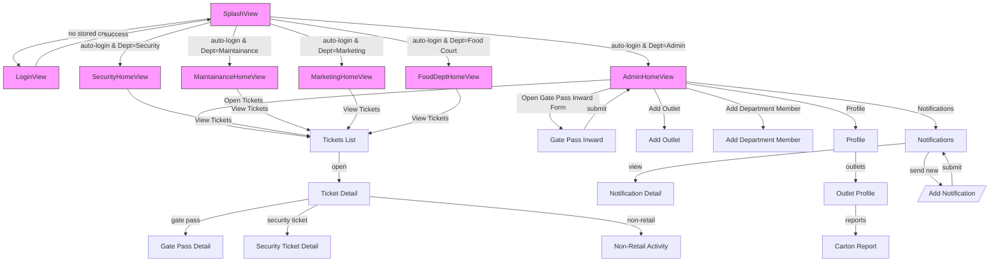

## Navigation Graph (Mermaid)

```mermaid
flowchart TD
  Splash[SplashView]
  Login[LoginView]
  AdminHome[AdminHomeView]
  SecurityHome[SecurityHomeView]
  MaintainHome[MaintainanceHomeView]
  MarketingHome[MarketingHomeView]
  FoodHome[FoodDeptHomeView]
  TicketsList[Tickets List]
  TicketDetail[Ticket Detail]
  GateDetail[Gate Pass Detail]
  SecurityDetail[Security Ticket Detail]
  NonRetailDetail[Non-Retail Activity]
  GateInward[Gate Pass Inward]
  AddOutlet[Add Outlet]
  AddDepart[Add Department Member]
  Notifications[Notifications]
  NotificationDetail[Notification Detail]
  Profile[Profile]
  OutletProfile[Outlet Profile]

  Splash -->|no stored creds| Login
  Splash -->|auto-login & Dept=Admin| AdminHome
  Splash -->|auto-login & Dept=Security| SecurityHome
  Splash -->|auto-login & Dept=Maintainance| MaintainHome
  Splash -->|auto-login & Dept=Marketing| MarketingHome
  Splash -->|auto-login & Dept=Food Court| FoodHome

  Login -->|success| Splash

  AdminHome -->|Open Tickets| TicketsList
  AdminHome -->|Add Outlet| AddOutlet
  AdminHome -->|Add Department Member| AddDepart
  AdminHome -->|Notifications| Notifications
  AdminHome -->|Profile| Profile

  SecurityHome -->|View Tickets| TicketsList
  MaintainHome -->|View Tickets| TicketsList
  MarketingHome -->|View Tickets| TicketsList
  FoodHome -->|View Tickets| TicketsList

  TicketsList -->|open| TicketDetail
  TicketDetail -->|gate pass| GateDetail
  TicketDetail -->|security ticket| SecurityDetail
  TicketDetail -->|non-retail| NonRetailDetail

  AdminHome -->|Open Gate Pass Inward Form| GateInward
  GateInward -->|submit| AdminHome

  Notifications -->|view| NotificationDetail
  Notifications -->|send new| AddNotification[/Add Notification/]
  AddNotification -->|submit| Notifications

  Profile -->|outlets| OutletProfile
  OutletProfile -->|reports| CartonReport[Carton Report]

  classDef screens fill:#f9f,stroke:#333,stroke-width:1px;
  class Splash,Login,AdminHome,SecurityHome,MaintainHome,MarketingHome,FoodHome screens;
```

Place this in a Mermaid-capable renderer (GitHub, VS Code Markdown Preview). Adjust nodes if you want more detail per screen.
